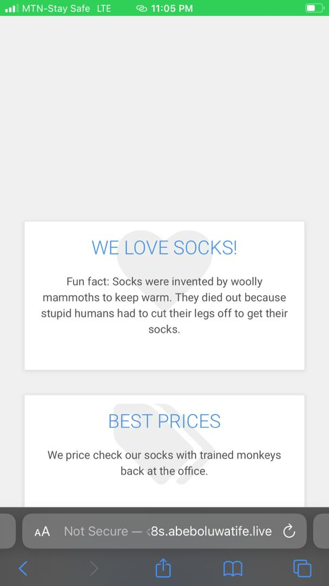
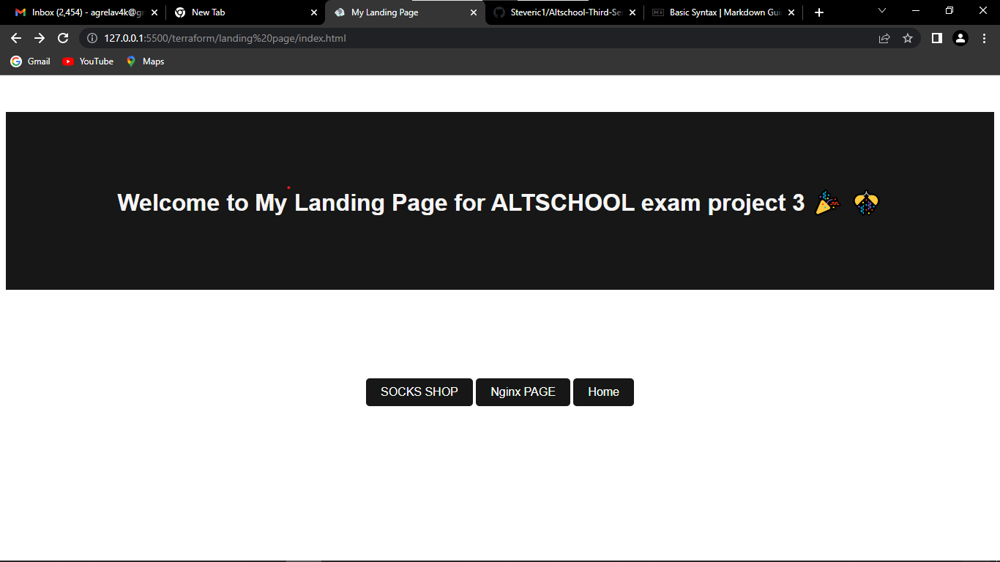
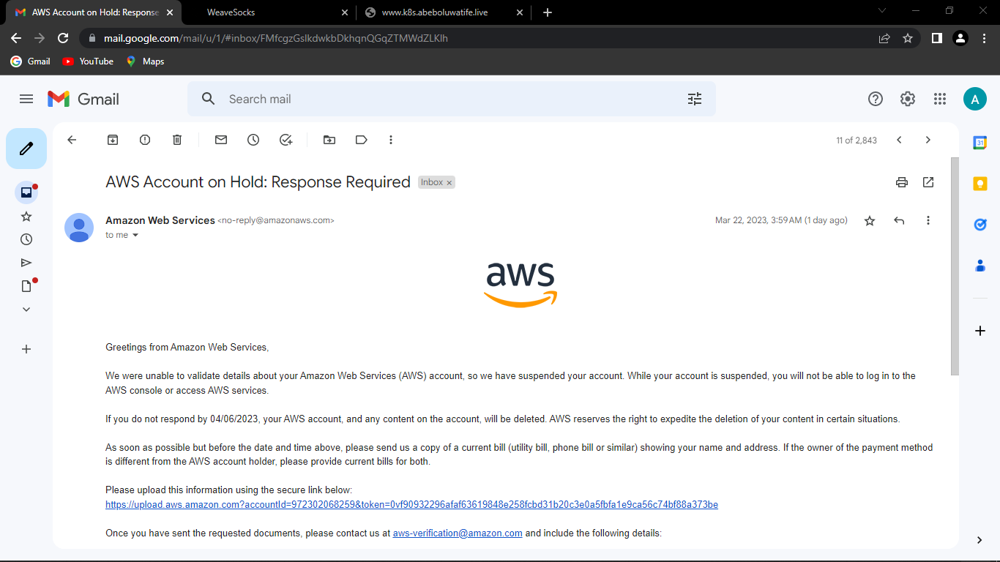
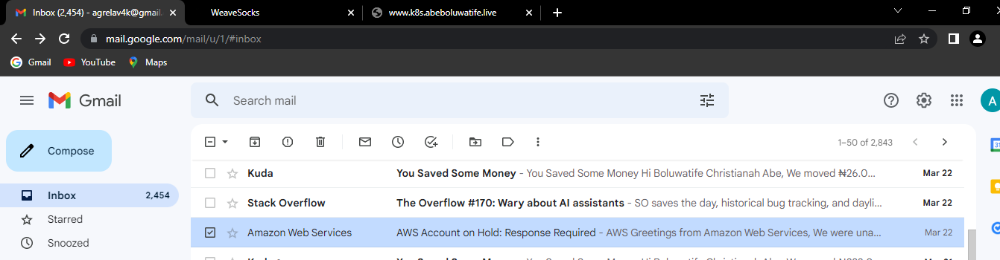

# examproject3

### ALTSCHOOL THIRD SEMESTER EXAM   

## socks app evidence with domain name www.k8s.abeboluwatife.live
 

## This project was done with Kubernetes Cluster, Terraform and AWS Cloud Provider.   

## 1. Terraform and kops cluster
I used terraform to setup the Kubernetes Cluster. And I deployed my web application and socks application to the cluster

For my second app I used Nginx Web Server and I containerize the nginx welcome web page using nginx server as my base image. Below are images of nginx welcome page provisioned as my second app and my landing page in html format  

  
  

## Evidence that my AWS account was blocked  
    
